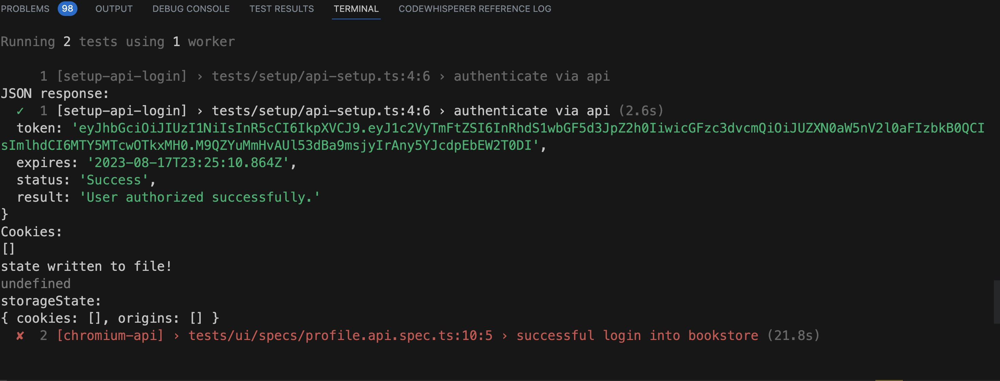

# Advanced Playwright

Hi 👋🏽!

Welcome to the course "Advanced Playwright" by [Renata Andrade](https://testingwithrenata.com/) for the [Test Automation University](https://testautomationu.applitools.com/).
Look at the [Introduction to Playwright](https://testautomationu.applitools.com/instructors/renata_andrade.html) course.

## About 

This is a repo with completed exercises from course [Advanced Playwright](https://testautomationu.applitools.com/playwright-advanced/). Forked from [raptatinha/tau-advanced-playwright: Course Advanced Playwright by Renata Andrade for Test Automation University](https://github.com/raptatinha/tau-advanced-playwright)

Chapter 1 
- [x] Exercise 1
- [x] Exercise 2
- [x] Exercise 3
- [x] Exercise 4
- [x] Exercise 5 - implement the trace of failures in setup
- [x] Exercise 6 - sign in using stored state 
- [ ] Exercise 7 - authentication via API request 
- [x] Exercise 8- multi-role sign in test

## Exercise 6 - authentication via API request issue

## Dependencies

- Playwright v1.35.1
- Node v20.3.0
- npm v9.6.5
- VSCode Version: 1.79.1 (Universal)
- Applitools v1.17.5

> Pre requirements: 
- [Node setup](https://nodejs.dev/en/learn/how-to-install-nodejs/)
- [VS Code setup](https://code.visualstudio.com/learn/get-started/basics)
- [iTerm setup](https://iterm2.com/documentation-one-page.html)

## Fork and clone the project

1. Copy the project URL `https://github.com/raptatinha/tau-advanced-playwright.git`;
1. Fork the project following the [GitHub instructions](https://docs.github.com/en/get-started/quickstart/fork-a-repo) - (use the parameter --clone=true);
1. Access the forked project `cd tau-advanced-playwright`

NOTE: Remember to add the secrets & variables to your local repo.

## Instal the project

IMPORTANT: Create your [.env](.env) file following the [.env.example](.env.example). The `APPLITOOLS_API_KEY` is the only param you'll need to uptdate to your credentials.

On your terminal, type:

1. `npm i`

## Run the project
Take a look at the [package.json](package.json) - scripts for more details.
The tests are using https://demoqa.com/

- `npm run test-ui-c` runs all tests on chromium (except the auth)
- `npm run test-ui-auth-admin` runs profile-stored-auth-multi-role-admin.spec.ts
- `npm run test-ui-auth-user` runs profile-stored-auth-multi-role-user.spec.ts
- `npm run test-ui-auth` runs profile-stored-auth-multi-role-example.spec.ts (test will fail due to application limitations)
- `npm run test-vrt` runs visual-regression.spec.ts - visual regression testing with applitools 

## Course Content:
### Chapter 1: Optimizing authentication
- Regular authentication with page objects;
- Stored authentication with global-setup via UI;
- Stored authentication for multi users;
- Advanced - auth via API request;
### Chapter 2: Dynamic Page Objects & Fixtures
- Hooks file for reusable page object creation
- URL builder for dynamic url creation
- Fixtures file for reusable flows
### Chapter 3: Interacting with APIs
- The APIRequestContext
- HTTP methods, request options, request URL
- How to identify an API call and use the swagger
- Execute request dynamic
- Error handling
- Reusability
### Chapter 4: Data Management
- Via .env files
- Via JSON
- Via API
- Via mock data
- Via CSV - https://playwright.dev/docs/test-parameterize#create-tests-via-a-csv-file
### Chapter 5: Visual Regression with Applitools
- Implementing a visual regression test
- Using different check settings
- Interpreting the results
### Chapter 6: Continuous Integration & Observability
- Github Actions
- The yml file
- Slack Integration
- Parallelization strategy & Sharding

___

💡 Share on LinkedIn something interesting you've learned! Don't forget to tag me [Renata Andrade](https://www.linkedin.com/in/raptatinha/).

💜 If you have questions, feel free to post them on [github](https://github.com/raptatinha/tau-advanced-playwright/issues).

Happy Testing 🎭
